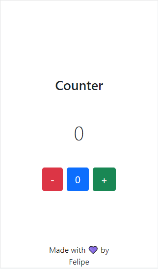

<h1 align="center">Counter</h1>

<p align="center">
  
</p>

## 💻 Project
Simple Counter made with Next.js, React JS, Bootstrap and TypeScript to practice this skills.
- [Live version](https://counter.felipepereirapinto.vercel.app/).

## 🚀 Technologies
This project was developed with the following technologies:

- Next.js
- React JS
- Bootstrap
- TypeScript

## 🏃 Running
To run this project you'll need:
- Node.js (v14.17.0)
- npm (v6.14.13)
- Terminal (like Git Bash)

After cloning/downloading the project, install the dependencies:
```
npm install
```

Run the app
```
npm run dev
```
